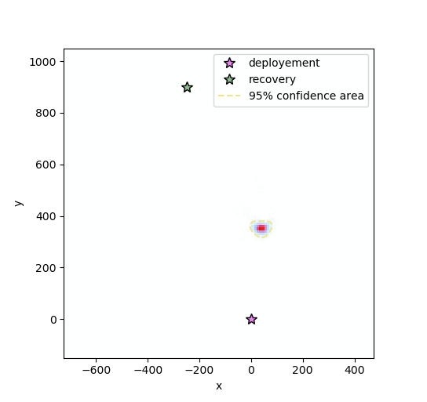

Localization script
-------------------

This scripts allows to retrieve the location of RR03. It returns the most probable drift from the deployment location. The Inputs and Parameter parts can be modified to fulfill the user needs.

.. literalinclude:: ../examples/localization.py
   :language: python

.. highlight:: none

Output::

   ------------------
   LOCALIZATION SCRIPT
   ------------------
   Process AIS.
   Process Data.
   [########################################] | 100% Completed |  1min 21.4s
   Estimate Uncertainties.
   [########################################] | 100% Completed | 21.8s
   Plot results.

